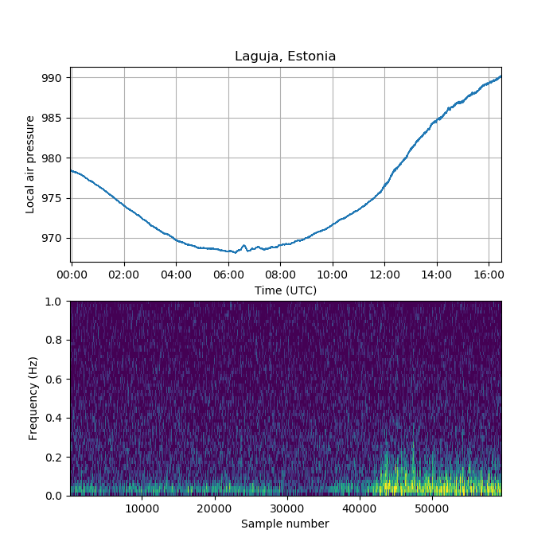

# High temporal resolution air pressure observations using an old smartphone.

This repository contains air pressure observations carried out using an old Samsung Galaxy S9 Plus smartphone using an app called AndroSensor. The data extracted from the apps logs have been converted to a CSV format contaning the UTC time stamp as seconds from the Unix epoch as well as the air pressure value. 

The file names follow the following convention:
```
[START TIME STAMP]_[END TIME STAMP]_[TEMPORAL RESOLUTION IN MILLISECONDS].csv
```
If the temporal resolution is marked as ```VRB```, then there are gaps in the data(due to phone power saving features, occuring at the early phase of the project until I realised that this problem was occurring and took countermeasures).

I've added a script ```example_plot.py``` illustrating an example plot generated from one of the files in the dataset, which will give an output such as this:



## Location
The observations were carried out in Laguja, Estonia (58.16°N, 26.45°E) with the device placed stationarily on the shelf

## Notes on data quality
There may be occasional spikes in the data due to accidentally moving the phone, especially around the start/end of the data fail. It is advisable that the observations be referenced against other sources. The air pressure is not reduced to sea level and is depicted as it came out of the phone at the time. Initially I was collecting data at 1 Pa resolution, later I switched to 10 mPa resolution. Use data at your own risk, no guarantees!

## Data usage
The data is in the public domain. Feel free to play around with the data, but I would still appreciate if you give credit to me as well if you manage to publish something out of it.

## Contact

Feel free to drop me an e-mail if you have any questions.\
Tarmo Tanilsoo\
tarmotanilsoo (at) gmail.com \
Twitter: @es5nhc
